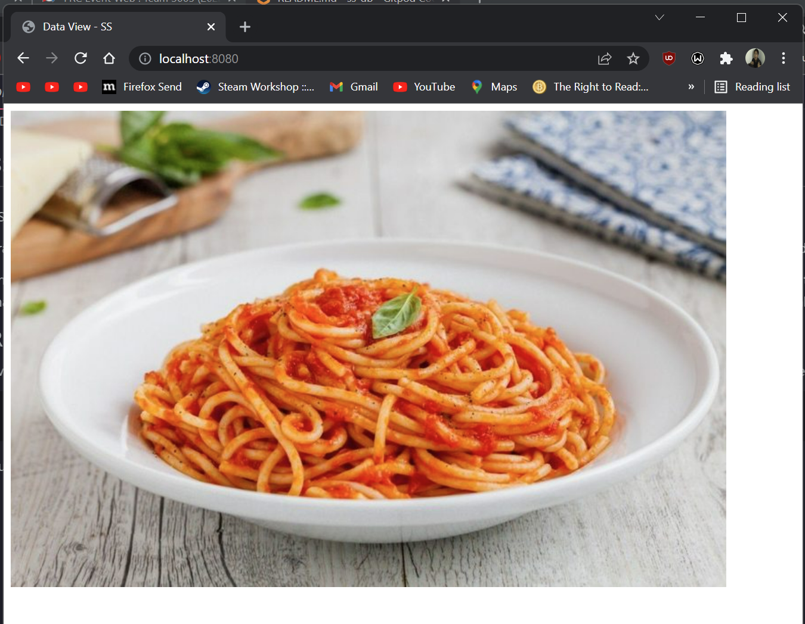

# Tera for Templates

Part of the advantage of using Tera to render user-facing pages in a data-oriented fashion. We can use this data-oriented design in order to create ergonomic templates.

```django
<!DOCTYPE html>
<html lang="en">
    <head>
        
        <title> - SS</title>
        
    </head>
    <body>
        <div id="content">
            
            
        </div>
    </body>
</html>
```

This template allows us to concisely create new pages, such as the below page which will inherit all the boilerplate from above.

```django

Data View



```

Now when passed a parameter for the image data, such as our all important image from the previous day's example, we get a page with a third of the boilerplate!



Beautiful!