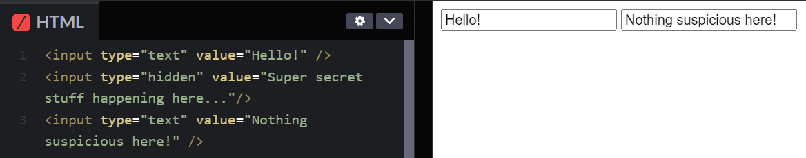

# Attaching Data to our Forms

The key advantage to a dedicated server-based, non-Google Form solution for a Scouting form is that we can attach arbitrary data to both sessions and ingested inputs. This could be anything, from saving the event a user is scouting from to even tracking patterns in a single user's data entry that we can account for during our data analysis. However, this becomes massively more difficult in the "low-JS" environment SS attempts to achieve. Since we're aiming to minimize the amount of "unsafety" in the entire stack, avoiding JS and using industry-tested, battle-hardened standards considered a part of the HTML/Web standard would be a massive boon. So how to we attach our arbitrary data to forms without JS?

## Don't show, do tell

HTML form inputs have a funny little variant called `hidden`. Using this variant prevents an input element from being shown, period.



By combining this with the Server-Side Rendering we explored in the last post, we can set an arbitrary value that will be passed along with the form.

```django
<input type="text" placeholder="Name" value="{{ name }}" />
<input type="hidden" value="{{ uuid }}" />
<input type="hidden" value="{{ token }}" />
<input type="text" placeholder="Event" />
```

